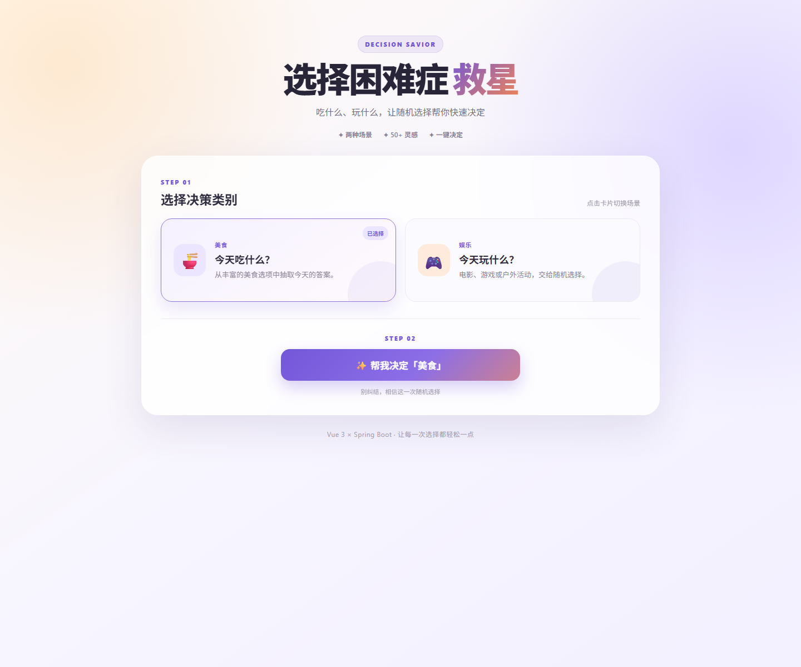

# 选择困难症救星

一个使用 **Vue 3 + Spring Boot** 实现的前后端分离随机决策网站。选择“美食”或“娱乐”类别后，前端会调用后端接口，随机返回一个结果和一条简短建议。



## 项目来源与改动

> 本项目以经授权公开使用的匿名集训示例代码为起点，起始版本提供基础随机决策功能；后续工作集中在环境联调、双分类扩展、界面重设计、交互优化、错误处理、测试与文档整理。

| 起始版本 | 本次完成的修改 |
|---|---|
| 单一美食类别 | 增加娱乐类别与对应随机数据 |
| 基础页面布局 | 重做配色、卡片、按钮和结果区域 |
| 简单结果展示 | 增加平滑结果动画和“再来一次”交互 |
| 弹窗式错误提示 | 改为页面内友好错误信息 |
| 重复请求时结果区域消失 | 保留结果卡片，仅更新内容，避免页面跳动 |
| 开放式跨域配置 | 限制为本地 Vue 开发地址 |
| 基础运行说明 | 补充接口、学习记录、验证结果和录屏讲稿 |

## 主要功能

- 美食、娱乐两种决策类别
- 后端根据 `type` 参数筛选并随机抽取
- 每条结果包含名称和简短建议
- “再来一次”时平滑更新结果
- 加载期间防止重复请求
- 后端未启动时显示页面内错误提示
- 桌面端与窄屏响应式布局

## 技术栈

| 层级 | 技术 |
|---|---|
| 前端 | Vue 3、Vite、Axios、HTML、CSS、JavaScript |
| 后端 | Java 17、Spring Boot 4.1.0、Maven |
| 通信 | HTTP GET、JSON、Vite 开发代理 |

## 工作流程

```text
用户点击决策按钮
→ Vue 执行 fetchDecision()
→ Axios 请求 /api/decision/random
→ Vite 将 /api 代理到 localhost:8080
→ Spring Boot Controller 按 type 筛选并随机抽取
→ 后端返回 JSON
→ Vue 更新响应式数据和结果区域
```

## 项目结构

```text
vue3-springboot-decision-savior/
├─ decision-front/          Vue 3 前端
│  ├─ src/App.vue           页面、状态和交互逻辑
│  └─ vite.config.js        本地 API 代理
├─ decision-backend/        Spring Boot 后端
│  └─ src/main/java/...     启动类与随机决策 Controller
├─ docs/
│  ├─ images/               项目截图
│  └─ LEARNING_LOG.md       学习过程与能力边界
├─ README.md
└─ 录屏讲稿.md
```

## 本地运行

### 环境要求

- JDK 17
- Maven 3.9+
- Node.js 22+
- npm 10+

### 1. 启动后端

```powershell
cd decision-backend
mvn spring-boot:run
```

看到 `Tomcat started on port 8080` 后，后端启动成功。

### 2. 启动前端

另开一个终端：

```powershell
cd decision-front
npm install
npm run dev
```

浏览器打开 `http://localhost:5173/`。

## 接口说明

### 随机决策

```http
GET /api/decision/random?type=美食
GET /api/decision/random?type=娱乐
```

| 参数 | 类型 | 必填 | 说明 |
|---|---|---|---|
| `type` | string | 否 | 支持“美食”和“娱乐”；为空时从全部数据中随机 |

响应示例：

```json
{
  "type": "娱乐",
  "name": "散步听歌",
  "description": "戴上耳机走一走，让大脑暂时放空。"
}
```

本项目实际接口直接返回 `{ type, name, description }`。学习资料中出现过 `{ code, data, msg }` 通用模板，但本项目以已经完成联调的实际前后端合同为准。

## 验证结果

```powershell
# 后端
mvn test

# 前端
npm run build
```

已验证：

- 后端测试：`Tests run: 1, Failures: 0, Errors: 0`
- 前端生产构建：成功
- 美食、娱乐接口：均能返回对应类别
- 前端页面：能够调用接口、更新结果并处理失败状态

## 学习说明

这是一个 **AI 辅助学习项目**。AI 参与了代码拆解、部分实现、样式设计、排错和文档整理；环境配置、启动操作、接口调用、功能验证、体验问题发现以及最终结果确认均由本人逐步完成。

本仓库用于证明已经在指导下走通 Vue 3 与 Spring Boot 的基础联调流程，不将“完成过项目”夸大为“已经能够独立完成完整全栈开发”。详细过程与下一步练习见 [学习记录](docs/LEARNING_LOG.md)。

## 相关文档

- [学习记录](docs/LEARNING_LOG.md)
- [录屏讲稿](录屏讲稿.md)
